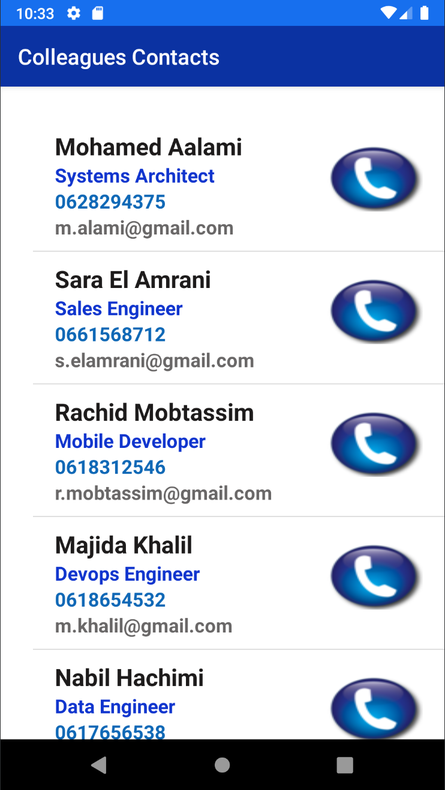
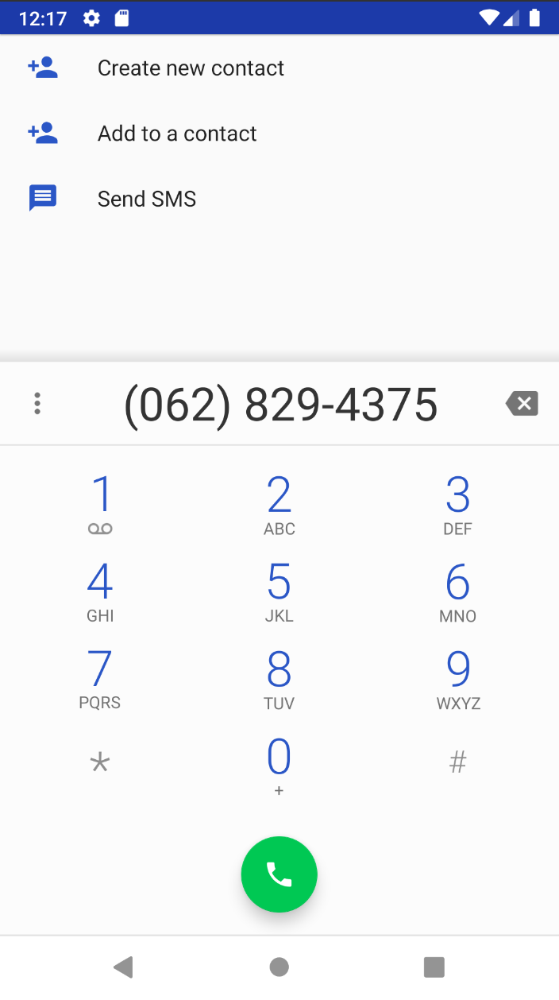

# Android Application by using Json data

## Description
the main of this application is the extract data from a json file, and adapte the object extracted with the list View
## Data Path
the file path : ./app/src/main/assets/data.json

## Application Screen
### main

### call screen
